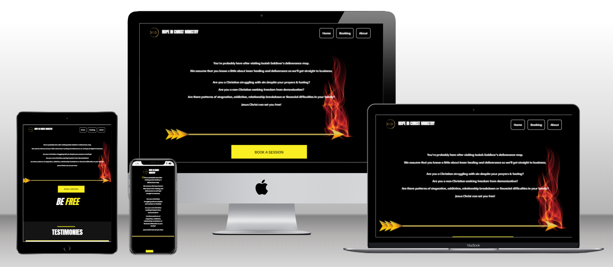

# Joyful Quiver Ministries

> The Joyful Quiver Ministries website is a Single Page Application (SPA) where users can find information about the ministry & book a deliverance session with the deliverance team. Built with HTML, CSS, Bootstrap, JavaScript and Webpack.

## Built With

- HTML5
- CSS3
- JavaScript
- Bootstrap
- Webpack
- TypeForm
- Canva
- Git

## Live Demo

[Live Demo Link](https://raw.githack.com/chelmerrox/joyful-quiver-ministries/page-structure-3/dist/index.html)

## Preview



## Getting Started

To get a local copy up and running follow these simple example steps.

### Prerequisites

- HTML5 & CSS3 
- JavaScript
- Bootstrap
- Webpack
- TypeForm
- Canva
- VSCode (or any other text editor)
- Git
- GitHub
- Command line/Terminal

### Setup

From the command line, do the following steps below:

1. Clone the projects' repository into your machine.

```bash
# Clone this repository
$ git clone git@github.com:chelmerrox/joyful-quiver-ministries.git

```
2. Change directory/Go into the repository with the command below.

```bash
$ cd joyful-quiver-ministries

```

## Author

👤 **Losalini Rokocakau**

- GitHub: [@chelmerrox](https://github.com/chelmerrox)
- Twitter: [@chelmerrox](https://twitter.com/chelmerrox)
- LinkedIn: [Losalini Rokocakau](https://linkedin.com/in/losalini-rokocakau)

## 🤝 Contributing

Contributions, issues, and feature requests are welcome!

Feel free to check the [issues page](https://github.com/chelmerrox/joyful-quiver-ministries/issues).

## Show your support

Give a ⭐️ if you like this project!

## Acknowledgments

- My God & family
- Microverse
